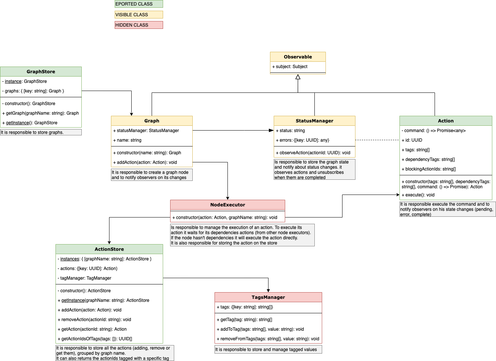

## Action Graph

This library is useful in case you need to synchronously perform dependent actions.
The main concept is that each action can be identified with tags that describe its type and has a series of dependent actions (which can be identified with tags in the same way).

For example, if we are in a form editor, we can identify each interaction performed by the user with `Actions`. Obviously, adding an item, editing and deleting are dependent actions on each other.

An example of user interaction can be:
- adding a text element (A)
- addition of a multiple choice element (B)
- change title of text element (A)
- moving (A) after (B)
- deleting multiple choice element (B)

In this the graph of dependency is the following:


In the picture, the blue labels are the tags to identify the actions and the red ones the dependencies.

### How to use

To add an action to the graph you can just to the following:
```ts
const command = () => fetch('https://your-api.com/endpoint');
const action = new Action(['tag1', 'tag2'], ['dep1', 'dep2'], command);
GraphStore.getInstance()
  .getGraph('yourGraphName').addNode(action);
```
To get updates on global status:
```ts
GraphStore.getInstance()
  .getGraph('yourGraphName')
  .statusManager.subject.subscribe({
      next: status => console.log(status),
  });
```
In general, Actions, Graphs and StatusManager can be observed.

### Architecture and responsability of each component



### Sequence diagrams

How addition and execution of a node works:

